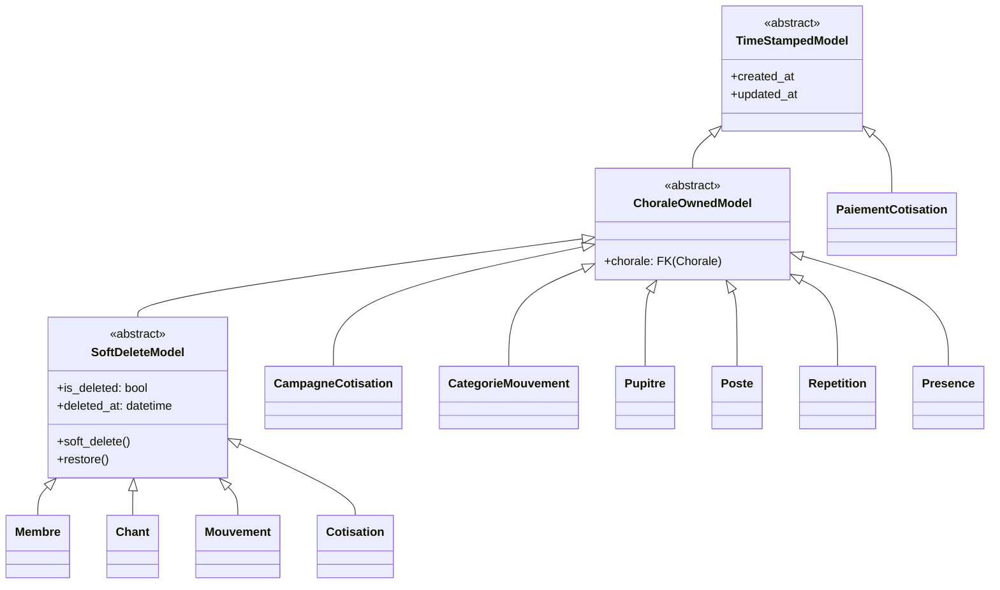
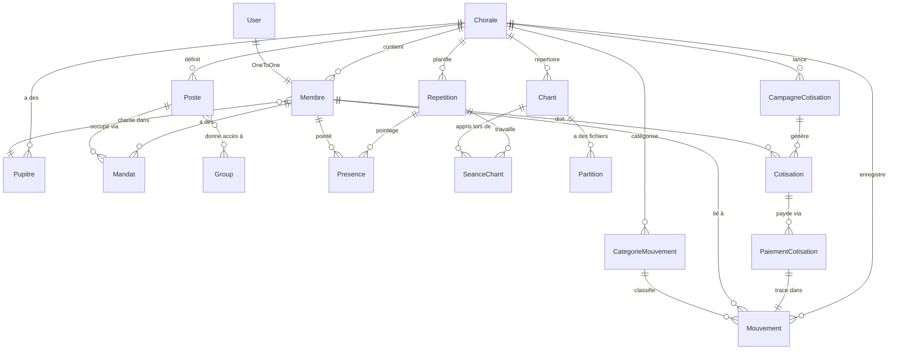

# ChoirManager — Plan d'Implémentation MVP (v2)

## Contexte

Plateforme professionnelle de gestion de chorale(s). Le brainstorming initial avec Claude a produit un modèle Membre/Mandat solide. Cette v2 du plan intègre un **changement architectural majeur** : la plateforme gère **plusieurs chorales** de manière transparente.

**Stack confirmé :**
- Backend : **Django 6**, DRF, SimpleJWT
- Frontend : **Angular 21** (Standalone Components, Signals), **Tailwind CSS v4**
- Database : **SQLite** (MVP), migration PostgreSQL prévue
- Soft-delete : logique applicative (indépendante de la DB)

---

## Changement Architectural Majeur : Multi-Chorale

> [!IMPORTANT]
> **Nouvelle entité `Chorale`** — Tout le système est désormais scopé à une chorale. Les modèles existants (Membre, Pupitre, Poste, Mandat, Chant, Répétition, Mouvement) reçoivent tous un `ForeignKey(Chorale)`.

### Stratégie Multi-Tenant Légère

```
┌─────────────────────────────────────────────────┐
│                  Super Admin                     │
│          Voit et gère TOUTES les chorales         │
├─────────────────────────────────────────────────┤
│                                                  │
│  ┌──────────────┐    ┌──────────────┐            │
│  │  Chorale A    │    │  Chorale B    │           │
│  │  "Les Voix"   │    │  "Harmonia"   │          │
│  │  Prefix: LVO  │    │  Prefix: HRM  │          │
│  │              │    │              │            │
│  │  Membres     │    │  Membres     │            │
│  │  Postes      │    │  Postes      │            │
│  │  Finances    │    │  Finances    │            │
│  │  Répertoire  │    │  Répertoire  │            │
│  └──────────────┘    └──────────────┘            │
│                                                  │
│  Les users non-super-admin ne voient que          │
│  LEUR chorale — UX transparente                  │
└─────────────────────────────────────────────────┘
```

**Mécanisme d'isolation :**
1. Un **middleware `ChoraleMiddleware`** injecte `request.chorale` à partir du membre connecté
2. Chaque **ViewSet** filtre automatiquement via `get_queryset()` sur `chorale=request.chorale`
3. Un **`ChoraleModelMixin`** fournit un `manager` qui filtre par chorale en contexte
4. Le **JWT payload** contient `chorale_id` et `chorale_prefix` pour le frontend
5. Le **préfixe matricule** est dérivé du champ `prefix` de la Chorale (ex: `LVO-0042`)

---

## Arborescence Complète du Projet

```
c:\PROJETS\PERSO\CHOIR-MANAGER\
│
├── chm-backend/                          # Projet Django 6
│   ├── manage.py
│   ├── requirements.txt
│   │
│   ├── chm_config/                       # Configuration Django
│   │   ├── __init__.py
│   │   ├── settings.py                   # SQLite, CORS, JWT, MEDIA
│   │   ├── urls.py                       # Routage API principal
│   │   ├── wsgi.py
│   │   └── asgi.py
│   │
│   ├── core/                             # App: modèles partagés, mixins, permissions
│   │   ├── __init__.py
│   │   ├── models.py                     # TimeStampedModel, SoftDeleteModel, Chorale
│   │   ├── middleware.py                 # ChoraleMiddleware
│   │   ├── permissions.py                # IsInGroup, IsBureau, IsTresorier...
│   │   ├── pagination.py                # StandardPagination
│   │   ├── mixins.py                     # ChoraleQuerySetMixin pour les ViewSets
│   │   └── utils.py
│   │
│   ├── authentication/                   # App: Auth JWT + Inscription
│   │   ├── __init__.py
│   │   ├── serializers.py                # CustomTokenSerializer, RegisterSerializer
│   │   ├── views.py                      # Login, Register, Profile
│   │   └── urls.py
│   │
│   ├── membres/                          # App: Membres & Structure
│   │   ├── __init__.py
│   │   ├── models.py                     # Pupitre, Poste, Membre, Mandat
│   │   ├── signals.py                    # Synchro groupes Django (post_save Mandat)
│   │   ├── serializers.py
│   │   ├── views.py                      # ViewSets DRF
│   │   ├── urls.py
│   │   ├── admin.py
│   │   ├── apps.py                       # ready() → import signals
│   │   ├── filters.py
│   │   ├── tests/
│   │   │   ├── __init__.py
│   │   │   ├── test_models.py
│   │   │   ├── test_signals.py
│   │   │   └── test_api.py
│   │   └── migrations/
│   │       ├── 0001_initial.py
│   │       └── 0002_data_bootstrap.py    # Pupitres + Postes + Groupes Django
│   │
│   ├── musique/                          # App: Répertoire Musical
│   │   ├── __init__.py
│   │   ├── models.py                     # Chant, Partition, SeanceChant
│   │   ├── serializers.py
│   │   ├── views.py
│   │   ├── urls.py
│   │   ├── admin.py
│   │   ├── apps.py
│   │   └── migrations/
│   │
│   ├── presences/                        # App: Répétitions & Présences
│   │   ├── __init__.py
│   │   ├── models.py                     # Repetition, Presence, PermissionRequest
│   │   ├── serializers.py
│   │   ├── views.py
│   │   ├── urls.py
│   │   ├── admin.py
│   │   ├── apps.py
│   │   └── migrations/
│   │
│   └── finances/                         # App: Cotisations & Caisse
│       ├── __init__.py
│       ├── models.py                     # CategorieMouvement, Mouvement, CampagneCotisation, Cotisation, PaiementCotisation
│       ├── serializers.py
│       ├── views.py
│       ├── urls.py
│       ├── admin.py
│       ├── apps.py
│       └── migrations/
│
└── chm-frontend/                         # Projet Angular 21
    ├── angular.json
    ├── package.json
    ├── tailwind.config.js
    ├── tsconfig.json
    ├── src/
    │   ├── index.html
    │   ├── main.ts
    │   ├── styles.css                    # Tailwind v4 imports
    │   │
    │   └── app/
    │       ├── app.component.ts
    │       ├── app.config.ts
    │       ├── app.routes.ts
    │       │
    │       ├── core/                     # Singleton services, guards, interceptors
    │       │   ├── services/
    │       │   │   ├── auth.service.ts           # JWT, login/register, rôles
    │       │   │   ├── api.service.ts            # HTTP wrapper générique
    │       │   │   └── notification.service.ts   # Toast/snackbar
    │       │   ├── guards/
    │       │   │   ├── auth.guard.ts             # Token valide ?
    │       │   │   └── role.guard.ts             # Groupe requis dans JWT ?
    │       │   ├── interceptors/
    │       │   │   └── jwt.interceptor.ts        # Inject Authorization header
    │       │   └── models/
    │       │       ├── user.model.ts
    │       │       ├── membre.model.ts
    │       │       ├── chorale.model.ts
    │       │       └── api-response.model.ts
    │       │
    │       ├── shared/                   # Composants réutilisables
    │       │   ├── components/
    │       │   │   ├── sidebar/
    │       │   │   ├── header/
    │       │   │   ├── data-table/
    │       │   │   └── confirm-dialog/
    │       │   └── pipes/
    │       │
    │       ├── features/                 # Modules fonctionnels (lazy-loaded)
    │       │   ├── auth/
    │       │   │   ├── login/
    │       │   │   └── register/
    │       │   ├── dashboard/
    │       │   ├── membres/
    │       │   │   ├── membre-list/
    │       │   │   ├── membre-detail/
    │       │   │   └── services/
    │       │   │       └── membres.service.ts
    │       │   ├── musique/
    │       │   │   ├── repertoire/
    │       │   │   ├── chant-detail/
    │       │   │   └── services/
    │       │   │       └── musique.service.ts
    │       │   ├── presences/
    │       │   │   ├── repetition-list/
    │       │   │   ├── pointage/
    │       │   │   └── services/
    │       │   │       └── presences.service.ts
    │       │   └── finances/
    │       │       ├── journal/
    │       │       ├── cotisations/
    │       │       ├── etat-caisse/
    │       │       └── services/
    │       │           └── finances.service.ts
    │       │
    │       └── layouts/
    │           ├── main-layout/          # Sidebar + Header + Content
    │           └── auth-layout/          # Layout minimaliste login/register
    │
    └── environments/
        ├── environment.ts
        └── environment.prod.ts
```

---

## Proposed Changes — Détail par Composant

---

### 1. Core — Chorale + Mixins + Permissions

#### [NEW] `core/models.py` — Entité Chorale + Mixins

Le modèle `Chorale` est le **tenant de premier niveau** :

```python
class Chorale(TimeStampedModel):
    """
    Entité racine — chaque chorale gérée sur la plateforme.
    Tous les autres modèles sont scopés à une Chorale.
    """
    nom         = models.CharField(max_length=200, unique=True)
    prefix      = models.CharField(
                      max_length=5, unique=True,
                      help_text="Préfixe pour les matricules. Ex: 'LVO' → LVO-0042"
                  )
    description = models.TextField(blank=True)
    logo        = models.ImageField(upload_to="chorales/logos/", blank=True, null=True)
    date_creation = models.DateField(
                      help_text="Date de création/fondation de la chorale"
                  )
    devise      = models.CharField(max_length=200, blank=True)  # Devise/motto
    email       = models.EmailField(blank=True)
    telephone   = models.CharField(max_length=25, blank=True)
    adresse     = models.TextField(blank=True)
    is_active   = models.BooleanField(default=True)

    class Meta:
        verbose_name = "Chorale"
        verbose_name_plural = "Chorales"

    def __str__(self):
        return self.nom


class ChoraleOwnedModel(TimeStampedModel):
    """
    Mixin abstrait — lie tout modèle à une Chorale.
    Hérité par Membre, Pupitre, Poste, Chant, Repetition, Mouvement...
    """
    chorale = models.ForeignKey(
        Chorale, on_delete=models.CASCADE,
        related_name="%(class)ss"  # auto: membres, postes, chants...
    )

    class Meta:
        abstract = True


class SoftDeleteModel(ChoraleOwnedModel):
    """
    Mixin : soft-delete + appartenance chorale.
    Pour les modèles sensibles (Membre, Mouvement, Chant).
    """
    is_deleted  = models.BooleanField(default=False, db_index=True)
    deleted_at  = models.DateTimeField(null=True, blank=True)

    def soft_delete(self):
        self.is_deleted = True
        self.deleted_at = timezone.now()
        self.save(update_fields=["is_deleted", "deleted_at", "updated_at"])

    def restore(self):
        self.is_deleted = False
        self.deleted_at = None
        self.save(update_fields=["is_deleted", "deleted_at", "updated_at"])

    class Meta:
        abstract = True
```

**Hiérarchie d'héritage des mixins :**



#### [NEW] `core/middleware.py` — Injection du contexte Chorale

```python
class ChoraleMiddleware:
    """
    Injecte request.chorale à partir du Membre connecté.
    Si super_admin → chorale = None (accès global).
    Si membre → chorale = membre.chorale.
    """
    def __call__(self, request):
        request.chorale = None
        if request.user.is_authenticated and hasattr(request.user, 'membre'):
            request.chorale = request.user.membre.chorale
        return self.get_response(request)
```

#### [NEW] `core/mixins.py` — Mixin ViewSet pour filtrage par Chorale

```python
class ChoraleFilterMixin:
    """
    Mixin ViewSet : filtre automatiquement le queryset
    par la chorale du user connecté.
    Super admin voit tout.
    """
    def get_queryset(self):
        qs = super().get_queryset()
        if self.request.user.is_superuser:
            return qs
        if self.request.chorale:
            return qs.filter(chorale=self.request.chorale)
        return qs.none()
```

#### [NEW] `core/permissions.py` — Permissions DRF

```python
class IsInGroup(BasePermission):
    """Vérifie l'appartenance à un ou plusieurs groupes Django."""
    required_groups = []

    def has_permission(self, request, view):
        if not request.user.is_authenticated:
            return False
        if request.user.is_superuser:
            return True
        user_groups = set(request.user.groups.values_list('name', flat=True))
        return bool(user_groups & set(self.required_groups))


class IsBureau(IsInGroup):
    required_groups = ["bureau"]

class IsTresorier(IsInGroup):
    required_groups = ["tresorier"]

class IsMaitreChoeur(IsInGroup):
    required_groups = ["maitre_choeur"]

class IsMembreActif(IsInGroup):
    required_groups = ["membre_actif"]
```

---

### 2. Authentication — JWT avec contexte Chorale

#### [NEW] `authentication/serializers.py`

Le payload JWT enrichi contient :

```json
{
  "user_id": 42,
  "membre_id": 15,
  "chorale_id": 1,
  "chorale_prefix": "LVO",
  "chorale_nom": "Les Voix d'Or",
  "nom_complet": "Jean Dupont",
  "groups": ["membre_actif", "bureau", "tresorier"],
  "email": "jean@example.com"
}
```

Cela permet au frontend Angular de :
- Afficher/masquer les menus selon les rôles (`groups`)
- Afficher le nom de la chorale dans le header
- Construire les routes sans requête supplémentaire

#### [NEW] `authentication/views.py`

| Endpoint | Méthode | Description |
|----------|---------|-------------|
| `/api/auth/login/` | POST | Login → JWT avec payload enrichi |
| `/api/auth/register/` | POST | Inscription → crée User + Membre + chorale par défaut |
| `/api/auth/refresh/` | POST | Refresh du token |
| `/api/auth/profile/` | GET/PATCH | Profil du membre connecté |

---

### 3. Membres — Modèle Principal (adapté multi-chorale)

#### [NEW] `membres/models.py`

Basé sur le `membres_models.py` existant, avec ces adaptations :

| Modèle | Hérite de | Scope Chorale | Soft-Delete |
|--------|-----------|:-------------:|:-----------:|
| `Pupitre` | `ChoraleOwnedModel` | ✅ | Non |
| `Poste` | `ChoraleOwnedModel` | ✅ | Non |
| `Membre` | `SoftDeleteModel` | ✅ | ✅ |
| `Mandat` | `TimeStampedModel` | Via Membre | Non |

**Changements clés par rapport au modèle existant :**

1. **`Pupitre`** : ajout de `chorale` FK — chaque chorale définit ses propres pupitres
2. **`Poste`** : ajout de `chorale` FK — postes spécifiques par chorale
3. **`Membre`** : hérite de `SoftDeleteModel` (qui inclut `chorale` FK) au lieu du `deleted_at` ad-hoc
4. **`Membre.generer_numero()`** : utilise désormais `chorale.prefix` → `LVO-0042` au lieu de `CHR-0042`
5. **`Mandat`** : pas de FK chorale directe (la chorale est déduite via `mandat.membre.chorale`)
6. **Signal** : extrait dans `signals.py`, connecté via `apps.py`

**Contrainte unique par chorale :**
```python
class Pupitre(ChoraleOwnedModel):
    nom = models.CharField(max_length=60)
    # ...
    class Meta:
        unique_together = ["chorale", "nom"]  # "Soprano" unique PAR chorale
```

#### [NEW] `membres/signals.py`

Identique à l'existant — la synchro Mandat → Groupes Django reste globale (les groupes Django ne sont pas scopés par chorale, ils portent les permissions système).

#### [NEW] `membres/serializers.py`

| Serializer | Usage |
|-----------|-------|
| `PupitreSerializer` | CRUD pupitres |
| `PosteSerializer` | CRUD postes (bureau only) |
| `MembreListSerializer` | Liste légère (id, nom, pupitre, statut) |
| `MembreDetailSerializer` | Détail complet + mandats imbriqués |
| `MandatSerializer` | CRUD mandats avec validation `unique_actif` |

#### [NEW] `membres/views.py`

Tous les ViewSets héritent de `ChoraleFilterMixin` :

| ViewSet | Accès | Actions |
|---------|-------|---------|
| `PupitreViewSet` | Lecture: tous, Écriture: bureau | list, retrieve, create, update |
| `PosteViewSet` | Bureau uniquement | CRUD complet |
| `MembreViewSet` | Lecture: tous, Écriture: bureau | CRUD + action `soft_delete` + filtres |
| `MandatViewSet` | Bureau uniquement | CRUD + action `terminer` |

#### [NEW] `membres/migrations/0002_data_bootstrap.py`

Data migration pour une chorale par défaut avec :
- **Groupes Django** : `membre_actif`, `membre_honoraire`, `bureau`, `tresorier`, `maitre_choeur`, `chef_pupitre`
- **Pupitres** par défaut : Soprano, Alto, Ténor, Basse
- **Postes** par défaut avec groupes associés :
  - Président → `[bureau]`
  - Vice-Président → `[bureau]`
  - Secrétaire Général → `[bureau]`
  - Trésorier → `[bureau, tresorier]`
  - Maître de chœur Principal → `[maitre_choeur]`
  - Maître de chœur Suppléant (`unique_actif=False`) → `[maitre_choeur]`
  - Chef de pupitre → `[chef_pupitre]`

---

### 4. Musique — Répertoire Musical

#### [NEW] `musique/models.py`

| Modèle | Hérite de | Description |
|--------|-----------|-------------|
| `Chant` | `SoftDeleteModel` | Titre, compositeur, style, tonalité, tempo |
| `Partition` | `ChoraleOwnedModel` | Fichier PDF/image lié à un Chant, optionnel pupitre |
| `SeanceChant` | `ChoraleOwnedModel` | Liaison Répétition ↔ Chant + statut apprentissage |

```python
class Chant(SoftDeleteModel):
    class Style(models.TextChoices):
        CLASSIQUE     = "classique",     "Classique"
        MODERNE       = "moderne",       "Moderne"
        TRADITIONNEL  = "traditionnel",  "Traditionnel"
        GOSPEL        = "gospel",        "Gospel"
        LITURGIQUE    = "liturgique",     "Liturgique"
        AUTRE         = "autre",         "Autre"

    titre        = models.CharField(max_length=200)
    compositeur  = models.CharField(max_length=200, blank=True)
    style        = models.CharField(max_length=20, choices=Style.choices)
    tonalite     = models.CharField(max_length=10, blank=True)
    tempo        = models.CharField(max_length=50, blank=True)
    notes        = models.TextField(blank=True)

    class Meta:
        unique_together = ["chorale", "titre", "compositeur"]

class Partition(ChoraleOwnedModel):
    chant      = models.ForeignKey(Chant, on_delete=models.CASCADE, related_name="partitions")
    titre      = models.CharField(max_length=200)
    fichier    = models.FileField(upload_to="partitions/%Y/%m/")
    type_voix  = models.ForeignKey("membres.Pupitre", null=True, blank=True, on_delete=models.SET_NULL)

class SeanceChant(ChoraleOwnedModel):
    class StatutApprentissage(models.TextChoices):
        INTRODUIT  = "introduit",  "Introduit"
        EN_TRAVAIL = "en_travail", "En travail"
        MAITRISE   = "maitrise",   "Maîtrisé"

    repetition = models.ForeignKey("presences.Repetition", on_delete=models.CASCADE)
    chant      = models.ForeignKey(Chant, on_delete=models.CASCADE)
    statut     = models.CharField(max_length=20, choices=StatutApprentissage.choices)
    notes      = models.TextField(blank=True)

    class Meta:
        unique_together = ["repetition", "chant"]
```

---

### 5. Présences — Répétitions & Pointage

#### [NEW] `presences/models.py`

| Modèle | Hérite de | Description |
|--------|-----------|-------------|
| `Repetition` | `ChoraleOwnedModel` | Date, heure, lieu, résumé de séance |
| `Presence` | `ChoraleOwnedModel` | Pointage d'un membre à une répétition |
| `PermissionRequest` | `ChoraleOwnedModel` | Demande d'absence anticipée |

```python
class Repetition(ChoraleOwnedModel):
    date        = models.DateField()
    heure_debut = models.TimeField()
    heure_fin   = models.TimeField(null=True, blank=True)
    lieu        = models.CharField(max_length=200, blank=True)
    resume      = models.TextField(blank=True, help_text="Résumé de la séance")
    dirigee_par = models.ForeignKey(
        "membres.Membre", null=True, blank=True,
        on_delete=models.SET_NULL, related_name="repetitions_dirigees"
    )

    class Meta:
        ordering = ["-date", "-heure_debut"]
        unique_together = ["chorale", "date", "heure_debut"]

class Presence(ChoraleOwnedModel):
    class StatutPresence(models.TextChoices):
        PRESENT    = "present",    "Présent"
        ABSENT     = "absent",     "Absent"
        PERMISSION = "permission", "En permission"
        RETARD     = "retard",     "En retard"

    repetition = models.ForeignKey(Repetition, on_delete=models.CASCADE, related_name="presences")
    membre     = models.ForeignKey("membres.Membre", on_delete=models.CASCADE, related_name="presences")
    statut     = models.CharField(max_length=20, choices=StatutPresence.choices)
    motif      = models.TextField(blank=True)

    class Meta:
        unique_together = ["repetition", "membre"]

class PermissionRequest(ChoraleOwnedModel):
    class StatutDemande(models.TextChoices):
        EN_ATTENTE = "en_attente", "En attente"
        APPROUVEE  = "approuvee",  "Approuvée"
        REFUSEE    = "refusee",    "Refusée"

    membre      = models.ForeignKey("membres.Membre", on_delete=models.CASCADE, related_name="demandes_permission")
    repetition  = models.ForeignKey(Repetition, null=True, blank=True, on_delete=models.SET_NULL)
    date_debut  = models.DateField()
    date_fin    = models.DateField()
    motif       = models.TextField()
    statut      = models.CharField(max_length=20, choices=StatutDemande.choices, default=StatutDemande.EN_ATTENTE)
    traitee_par = models.ForeignKey(
        "membres.Membre", null=True, blank=True,
        on_delete=models.SET_NULL, related_name="permissions_traitees"
    )
```

---

### 6. Finances — Journal de Caisse & Cotisations

#### [NEW] `finances/models.py`

| Modèle | Hérite de | Description |
|--------|-----------|-------------|
| `CategorieMouvement` | `ChoraleOwnedModel` | Type de mouvement (cotisation, don, achat...) |
| `Mouvement` | `SoftDeleteModel` | Entrée/sortie de caisse |
| `CampagneCotisation` | `ChoraleOwnedModel` | **Définition** d'une cotisation (motif, montant, type) |
| `Cotisation` | `SoftDeleteModel` | Attribution d'une campagne à un membre + suivi paiement |

> [!NOTE]
> **Concept clé : `CampagneCotisation`** — Une cotisation n'existe jamais "en l'air". Elle est toujours rattachée à une **campagne** qui définit son but concret. Exemples :
> - "Cotisation mensuelle — Janvier 2025" (récurrente)
> - "Confection uniforme 2025" (ponctuelle)
> - "Sortie détente Kribi" (événementielle)
> - "Cotisation annuelle 2025" (annuelle)
>
> La campagne porte le **montant unitaire**, le **type** (mensuelle/ponctuelle/annuelle), et la **période**. Ensuite, chaque `Cotisation` lie un membre à cette campagne et traque son paiement.

```python
class CategorieMouvement(ChoraleOwnedModel):
    """Catégorie de mouvement financier (cotisation, don, achat matériel...)."""
    nom            = models.CharField(max_length=100)
    type_mouvement = models.CharField(max_length=10, choices=[("entree", "Entrée"), ("sortie", "Sortie")])
    description    = models.TextField(blank=True)

    class Meta:
        unique_together = ["chorale", "nom"]
        verbose_name = "Catégorie de mouvement"


class Mouvement(SoftDeleteModel):
    """Ligne du journal de caisse — chaque entrée ou sortie d'argent."""
    class Sens(models.TextChoices):
        ENTREE = "entree", "Entrée"
        SORTIE = "sortie", "Sortie"

    date           = models.DateField()
    montant        = models.DecimalField(max_digits=12, decimal_places=2)
    sens           = models.CharField(max_length=10, choices=Sens.choices)
    categorie      = models.ForeignKey(CategorieMouvement, on_delete=models.PROTECT)
    motif          = models.CharField(max_length=300)
    membre         = models.ForeignKey(
                         "membres.Membre", null=True, blank=True,
                         on_delete=models.SET_NULL, related_name="mouvements",
                         help_text="Membre concerné (si paiement de cotisation, don nominatif...)"
                     )
    enregistre_par = models.ForeignKey(
                         "membres.Membre", on_delete=models.PROTECT,
                         related_name="mouvements_enregistres"
                     )
    piece_jointe   = models.FileField(upload_to="finances/%Y/%m/", blank=True)

    class Meta:
        ordering = ["-date", "-created_at"]
        verbose_name = "Mouvement financier"


class CampagneCotisation(ChoraleOwnedModel):
    """
    Définition d'une cotisation — le POURQUOI.

    Exemples :
      - "Cotisation mensuelle — Janvier 2025"  (type=mensuelle)
      - "Confection uniforme 2025"             (type=ponctuelle)
      - "Sortie détente Kribi"                 (type=evenementielle)
      - "Cotisation annuelle 2025"             (type=annuelle)

    Le champ montant_unitaire définit le montant attendu par membre.
    is_obligatoire détermine si tous les membres actifs sont auto-inscrits.
    """
    class TypeCampagne(models.TextChoices):
        MENSUELLE      = "mensuelle",      "Mensuelle"
        ANNUELLE       = "annuelle",       "Annuelle"
        PONCTUELLE     = "ponctuelle",     "Ponctuelle"
        EVENEMENTIELLE = "evenementielle", "Événementielle"

    nom              = models.CharField(max_length=200)
    description      = models.TextField(blank=True)
    type_campagne    = models.CharField(max_length=20, choices=TypeCampagne.choices)
    montant_unitaire = models.DecimalField(
                           max_digits=10, decimal_places=2,
                           help_text="Montant attendu par membre"
                       )
    date_debut       = models.DateField(help_text="Début de la période de collecte")
    date_fin         = models.DateField(
                           null=True, blank=True,
                           help_text="Fin de la période (null = pas de deadline)"
                       )
    is_obligatoire   = models.BooleanField(
                           default=True,
                           help_text="Si True, génère automatiquement une cotisation pour chaque membre actif"
                       )
    is_active        = models.BooleanField(default=True)

    class Meta:
        ordering = ["-date_debut"]
        verbose_name = "Campagne de cotisation"
        verbose_name_plural = "Campagnes de cotisation"

    def __str__(self):
        return f"{self.nom} ({self.get_type_campagne_display()})"


class Cotisation(SoftDeleteModel):
    """
    Attribution d'une campagne à un membre + suivi du paiement.

    Exemple : Jean Dupont doit 5000 FCFA pour "Uniforme 2025".
    Il a payé 3000 → statut = PARTIEL, reste_a_payer = 2000.
    """
    class StatutCotisation(models.TextChoices):
        EN_ATTENTE = "en_attente", "En attente"
        PARTIEL    = "partiel",    "Partiel"
        PAYE       = "paye",       "Payé"
        EXONERE    = "exonere",    "Exonéré"

    campagne     = models.ForeignKey(
                       CampagneCotisation, on_delete=models.CASCADE,
                       related_name="cotisations",
                       help_text="La campagne/le motif de cette cotisation"
                   )
    membre       = models.ForeignKey(
                       "membres.Membre", on_delete=models.CASCADE,
                       related_name="cotisations"
                   )
    montant_du   = models.DecimalField(
                       max_digits=10, decimal_places=2,
                       help_text="Peut différer du montant_unitaire (exonération partielle)"
                   )
    montant_paye = models.DecimalField(max_digits=10, decimal_places=2, default=0)
    statut       = models.CharField(
                       max_length=20,
                       choices=StatutCotisation.choices,
                       default=StatutCotisation.EN_ATTENTE
                   )
    notes        = models.TextField(blank=True)

    class Meta:
        unique_together = ["campagne", "membre"]  # Un membre, une seule cotisation par campagne
        verbose_name = "Cotisation"
        verbose_name_plural = "Cotisations"

    def __str__(self):
        return f"{self.membre.nom_complet} — {self.campagne.nom} ({self.get_statut_display()})"

    @property
    def reste_a_payer(self):
        """Montant restant dû."""
        return max(self.montant_du - self.montant_paye, 0)

    @property
    def is_solde(self):
        """True si la cotisation est intégralement payée."""
        return self.montant_paye >= self.montant_du


class PaiementCotisation(TimeStampedModel):
    """
    Trace chaque paiement individuel sur une cotisation.
    Permet les paiements partiels et l'historique complet.

    Exemple : Jean paie 3000 le 15/01, puis 2000 le 28/01.
    → 2 PaiementCotisation liés à la même Cotisation.
    → Chaque paiement crée automatiquement un Mouvement dans le journal.
    """
    cotisation   = models.ForeignKey(
                       Cotisation, on_delete=models.CASCADE,
                       related_name="paiements"
                   )
    montant      = models.DecimalField(max_digits=10, decimal_places=2)
    date_paiement = models.DateField()
    mouvement    = models.OneToOneField(
                       Mouvement, on_delete=models.SET_NULL,
                       null=True, blank=True,
                       related_name="paiement_cotisation",
                       help_text="Mouvement correspondant dans le journal de caisse"
                   )
    notes        = models.TextField(blank=True)

    class Meta:
        ordering = ["-date_paiement"]
        verbose_name = "Paiement de cotisation"
```

---

### 7. Frontend Angular 21 — Architecture

#### Configuration technique

- **Standalone Components** exclusivement (plus de NgModule)
- **Signals** pour la réactivité (pas de BehaviorSubject inutile)
- **`provideHttpClient(withInterceptors([jwtInterceptor]))`** — Angular 21 pattern
- **`inject()` function** au lieu du constructor DI
- **Lazy loading** via `loadComponent` dans les routes
- **Tailwind CSS v4** intégré via `@tailwindcss/postcss`
- **Guards fonctionnels** (`CanActivateFn`)

#### Structure des routes

```typescript
export const routes: Routes = [
  // Auth — layout minimaliste
  { path: 'login', loadComponent: () => import('./features/auth/login/login.component') },
  { path: 'register', loadComponent: () => import('./features/auth/register/register.component') },

  // App — layout principal (sidebar + header)
  {
    path: '',
    loadComponent: () => import('./layouts/main-layout/main-layout.component'),
    canActivate: [authGuard],
    children: [
      { path: '', redirectTo: 'dashboard', pathMatch: 'full' },
      { path: 'dashboard', loadComponent: () => import('./features/dashboard/dashboard.component') },
      { path: 'membres', loadComponent: () => import('./features/membres/membre-list/membre-list.component') },
      { path: 'membres/:id', loadComponent: () => import('./features/membres/membre-detail/membre-detail.component') },
      { path: 'musique', loadComponent: () => import('./features/musique/repertoire/repertoire.component') },
      { path: 'presences', loadComponent: () => import('./features/presences/repetition-list/repetition-list.component') },
      {
        path: 'finances',
        canActivate: [roleGuard(['bureau', 'tresorier'])],
        children: [
          { path: '', loadComponent: () => import('./features/finances/journal/journal.component') },
          { path: 'cotisations', loadComponent: () => import('./features/finances/cotisations/cotisations.component') },
        ]
      },
    ]
  }
];
```

#### JWT Interceptor (Angular 21 pattern)

```typescript
export const jwtInterceptor: HttpInterceptorFn = (req, next) => {
  const authService = inject(AuthService);
  const token = authService.accessToken();  // Signal

  if (token) {
    req = req.clone({
      setHeaders: { Authorization: `Bearer ${token}` }
    });
  }
  return next(req);
};
```

---

## Diagramme Relationnel Global



---

## Ordre d'Exécution

| Phase | Action | Fichiers |
|-------|--------|----------|
| **1** | Init projet Django + `chm_config/settings.py` + `requirements.txt` | Configuration |
| **2** | Module `core` — Chorale, mixins, permissions, middleware | 5 fichiers |
| **3** | Module `authentication` — JWT + inscription | 3 fichiers |
| **4** | Module `membres` — models, signals, serializers, views, data migration | 8 fichiers |
| **5** | Module `musique` — models, serializers, views | 5 fichiers |
| **6** | Module `presences` — models, serializers, views | 5 fichiers |
| **7** | Module `finances` — models, serializers, views | 5 fichiers |
| **8** | Init projet Angular 21 + Tailwind v4 | Configuration |
| **9** | Frontend core — auth service, JWT interceptor, guards | 6 fichiers |
| **10** | Frontend layout + dashboard | 3 fichiers |
| **11** | Frontend features — membres, musique, présences, finances | ~16 fichiers |

> [!NOTE]
> **Livraison immédiate** : À l'approbation, je commence par les phases 1-4 (tout le backend core + membres avec le modèle multi-chorale complet).

---

## Verification Plan

### Automated Tests
```bash
python manage.py check                      # Config Django valide
python manage.py makemigrations --check     # Migrations à jour
python manage.py test membres              # Tests models + signals + API
python manage.py test authentication       # Tests JWT
```

### Manual Verification
- Créer un superuser + une Chorale via admin
- Tester le flux complet : inscription → login → JWT → requête filtrée par chorale
- Vérifier l'isolation : un membre de Chorale A ne voit pas les données de Chorale B
- Créer un Mandat → vérifier que les groupes Django sont synchronisés
- Soft-delete un Membre → vérifier la désactivation en cascade
